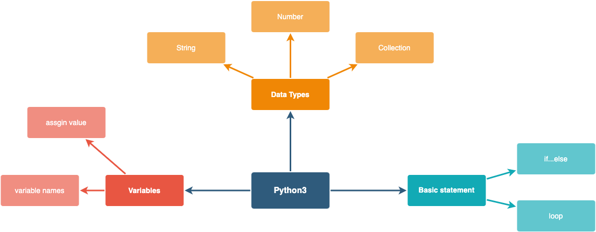

# Introduce
## What we need in the future.

- Automatically work.

# What is python
- Python is a popular programming language and released in 1991.
- Now is Python3

## Do can python do 
- as a backend server
- as a data analyser
- as a picture printer
- as a task script executer

## Why we choose python
- simple syntax similar to English
- write programs with fewer lines than some other programming languages
- for different platforms

# Hello python
```python
print("Hello, Python!")
```

# The basic of python
## variables
- containers for storing data values.

## Demo
```python
x = 5
y = "John"
print(x)
print(y)

test_var = "I am  snake"
testVar = "I am camel"
```

## Data types
- Text Type:	str
- Numeric Types:	int, float, complex
- Sequence Types:	list, tuple, range
- Mapping Type:	dict
- Set Types:	set, frozenset
- Boolean Type:	bools
- Binary Types:	bytes, bytearray, memoryview
- None Type:	NoneType

### str
```python
x = "John"
print(x)
```
### int
```python
x = 5
print(x)
```
### float
```python
x = 5.0
print(x)
```
### list
```python
x = [1,2,3]
print(x)
```
### tuple
```python
x = (1,2,3)
print(x)
```

### dict
```python
x = {
  1: "I am 1",
  2: "I am 2",
  3: "who am I?"
}
print(x)
```

### show time
```python
import matplotlib.pyplot as plt
import numpy as np

labels = ['Game1', 'Game2', 'Game3', 'Game4', 'Game5']
men_scores = [20, 34, 30, 35, 27]
women_scores = [25, 32, 34, 20, 25]

x = np.arange(len(labels))  # the label locations

width = 0.35  # the width of the bars

fig, ax = plt.subplots()

men_bars = ax.bar(x - width / 2, men_scores, width, label='Men')
women_bars = ax.bar(x + width / 2, women_scores, width, label='Women')

# Add some text for labels, title and custom x-axis tick labels, etc.
ax.set_ylabel('Game Scores')
ax.set_title('Game Scores by group and gender')
ax.set_xticks(x, labels)
ax.legend()

ax.bar_label(men_bars, padding=3)
ax.bar_label(women_bars, padding=3)

fig.tight_layout()

plt.show()
```


## Statement

### condition
```python
a = 33
b = 200
if b > a:
  print("b is greater than a")
```


### loop
```python
i = 1
while i < 6:
  print(i)
  if i == 3:
    break
  i += 1

fruits = ["apple", "banana", "cherry"]
for x in fruits:
  print(x)
```


## diagram



